# Tuning the JPC-12

[LIST OF ARTICLES](#/notebook/articles/)

- **Published:** 2024-07-15
- **Last update:** 2025-06-18

## Table of Contents

- [Tuning the JPC-12](#tuning-the-jpc-12)
  - [Table of Contents](#table-of-contents)
  - [Technical Components](#technical-components)
    - [Standard parts](#standard-parts)
    - [Extra parts added by myself](#extra-parts-added-by-myself)
  - [Operational setup](#operational-setup)
  - [NanoVNA-H readings (SWR \& Smith Chart)](#nanovna-h-readings-swr--smith-chart)

The JPC-12 (also known as PAC-12) is a portable HF vertical antenna that features a very handy set of parts that assemble quickly and that is able to cover, officially, 40m through 6m, but, unofficially, 60 and 80m as well. It handles up to 100 watts.

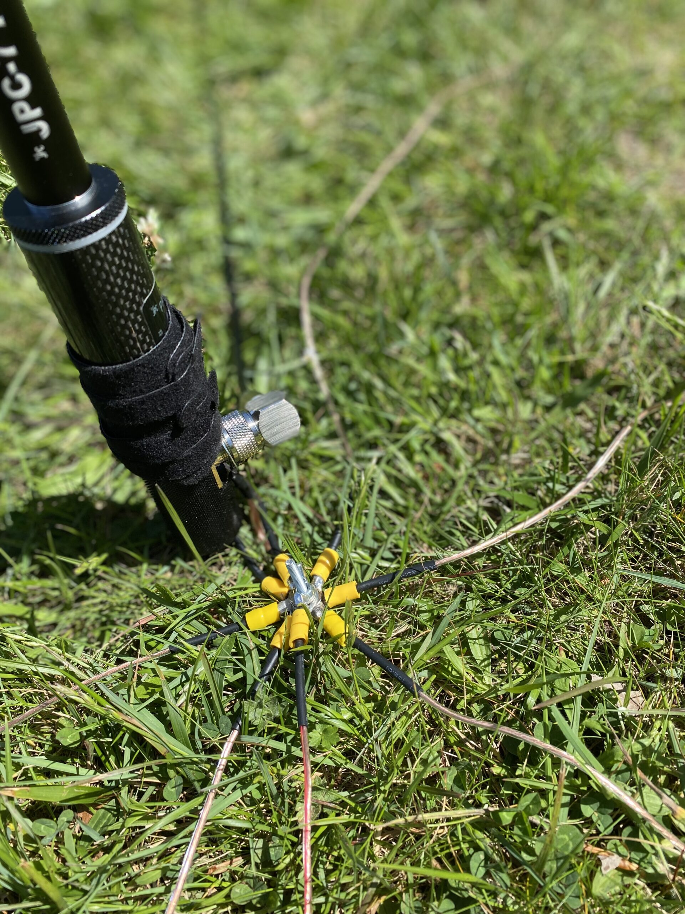

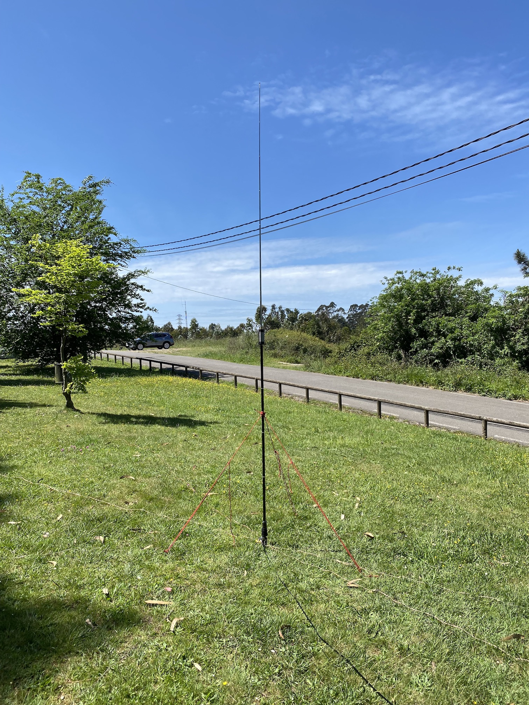

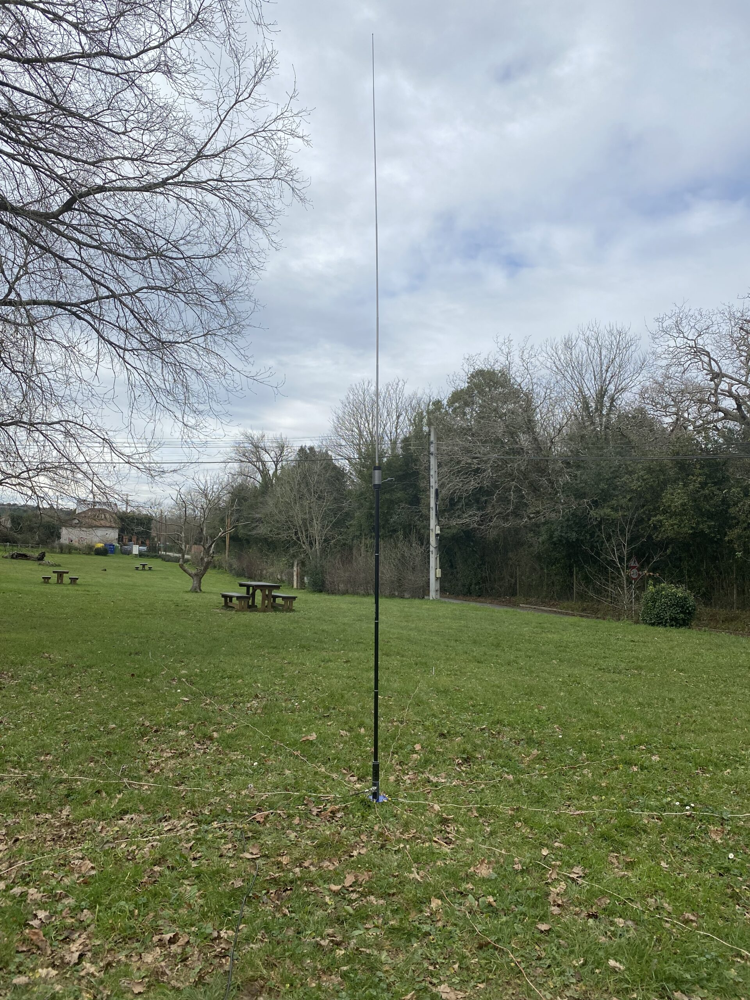

This antenna has been in production for several years now. The new version of the antenna, put into the market in October 2020 included an improved version of the main tuning coil. This new version of the tuning coil has been marked with the right number of turns for the 20m and 40m bands, making it easier and faster to set up, even without an antenna analyser.

## Technical Components

### Standard parts

- 1 x Coil with tuning pre-selection for 20m and 40m bands.
- 1 x Extendable aluminum rod of 0,328m folded and 2,545m when fully extended.
- 4 x Fixed length aluminum alloy mast sections, 0,323m each.
- 1 x Wire trap (hidden coil) with the main UHF (SO-239) connector.
- 1 x Ground anchor spike.

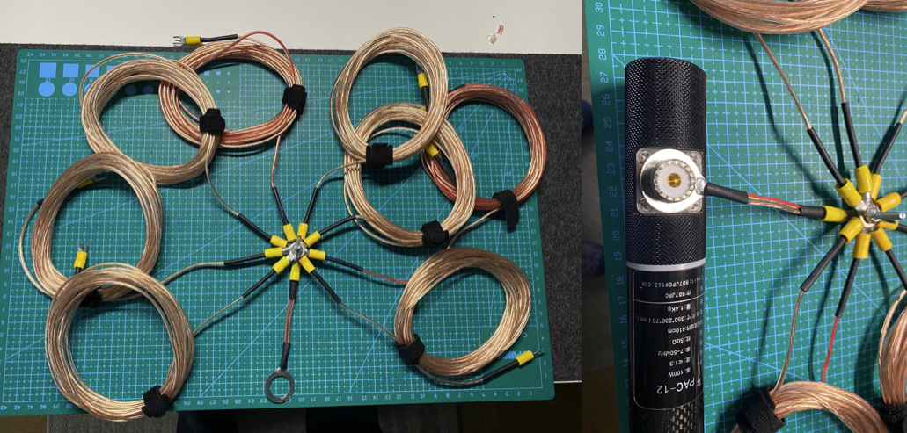

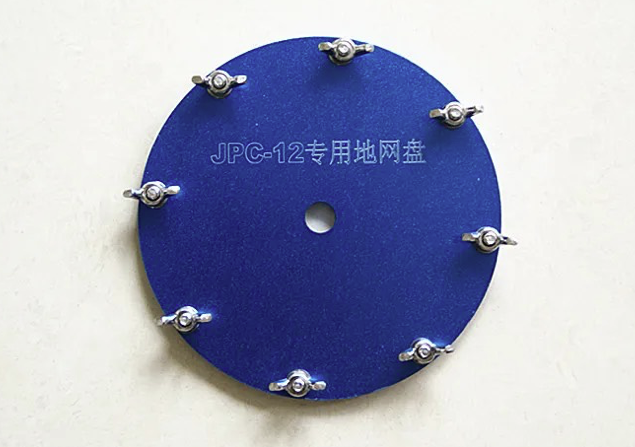

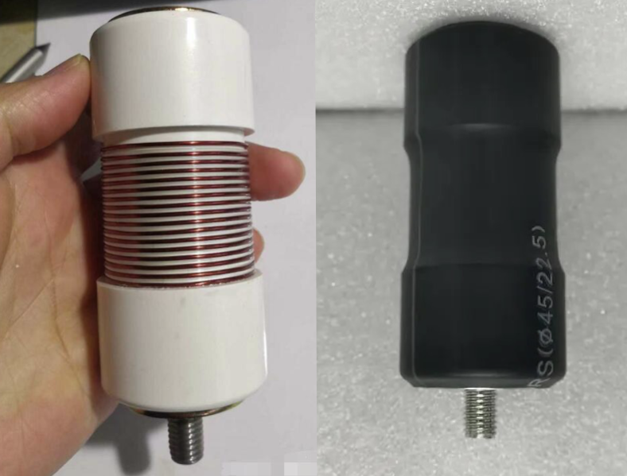

### Extra parts added by myself

- 8 x Counterpoise cables made of 5m of wire with 0,75mm^2 section each. For clarification, I tried longer radials (10m or more) with the same or worst results.
- 1 x Aluminum alloy ground plate for counterpoise cabling connection. This is an improved version of the interconnection shown in Figure 5, above.
- 1 x Coil for 40m band. This coil can be used alone for the aforementioned band or it can also be used in combination with the standard pre-selectable coil and an elongated extendable aluminum rod to reach 60m and 80m bands.

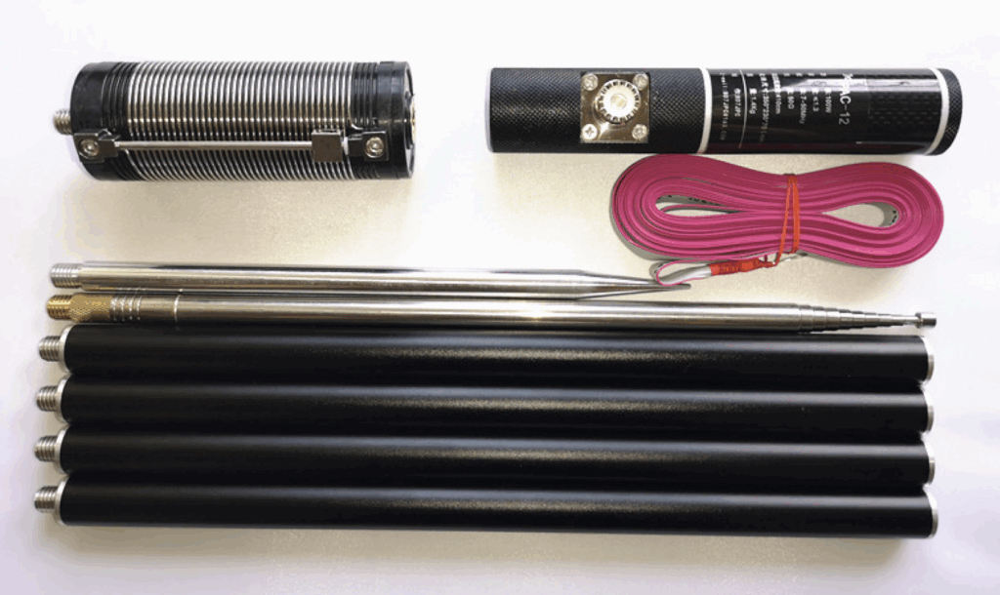

## Operational setup

| Band | Tuning frequency | VSWR on Icom IC-705 | Coil in use? | Theoretical length for 1/4 λ | Extendable rod length | # of fixed length sections |
| --- | --- | --- | --- | --- | --- | --- |
| 80m | 3.55 MHz | – | Yes | See note [1] below | – | – |
| 60m | 5.35 MHz | – | Yes | See note [2] below | – | – |
| 40m | 7.1 MHz | 1 : 1.4 | Yes | Coil in 40 MHz position (silver) | 2.4m | 4 or 1.3m |
| 30m | 10.125 MHz | 1 : 1.5 | Yes | See note [3] below | 2.202m | 4 or 1.3m |
| 20m | 14.2 MHz | 1 : 1.0 | Yes | Coil in 20 MHz position (gold) | 2.332m | 4 or 1.3m |
| 17m | 18.12 MHz | 1 : 1.2 | No | 4.25m | 2.361m | 4 or 1.3m |
| 15m | 21.3 MHz | 1 : 1.3 | No | 3.75m | 1.81m | 4 or 1.3m |
| 12m | 24.9 MHz | 1 : 1.4 | No | 3m | 1.57m | 4 or 1.3m |
| 10m | 28.4 MHz | 1 : 1.3 | No | See note [4] below | 2.25m | None |
| 10m | 28.4 MHz | 1 : 1.4 | No | 2.5m | 1.271m | 4 or 1.3m |

**NOTE**
*Above table of values show data gathered in my specific environmental conditions. Use as mere reference only. For best performance, tune your antenna system on-site before operating. When tuning, always use low power. In regard to measures, please note the extendable rod has been measured including the threaded part of the rod, as it’s indicated in the figure below. In regard to measures related to the black coated fixed length aluminum parts, measures were taken without the threaded part of the rod and all of the elements measure the same.*

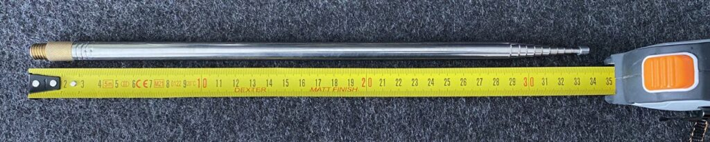

1️⃣ – Tuning on 80m (Last Update: Apr 23, 2023; Back for Further Details)

This antenna is originally not meant to be used on 80m, but, using two coils together (the standard preselectable coil plus another fixed coil designed for 40m) in combination with a long extendable rod can do the trick and make a match.*

2️⃣ — Tuning on 60m (Last Update: Apr 23, 2023; Back for Further Details)

This antenna is originally not meant to be used on 60m.

I’m yet researching how to approach this band segment. Most probably I will be using a second fixed coil, designed for 40m, and I will be setting up the preselectable band on the antenna’s standard coil close to 20m mark. With this setup I’ll be trying to get closer to 60m band so finally I can play with the extendable aluminum rod seeking for a match.*

3️⃣ — Tuning on 30m

In order to tune the JPC-12 for 30m band (10.100 MHz – 10.150 MHz) it’s necessary to place the tuning knob **9 turns below the red & gold mark,** that corresponds to 20m band, and use the number of fixed length section with aluminum rod extended to the length detailed in the “Operational Setup” table above.*

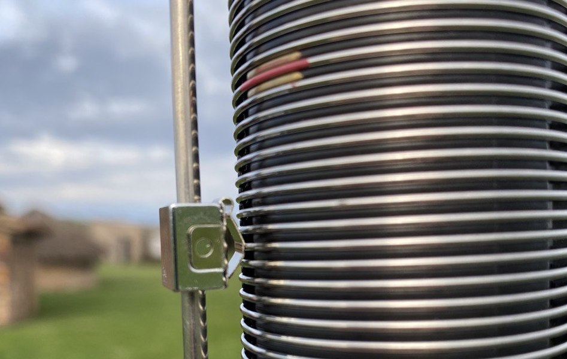

*Tuning position obtained for 30m. The preselector slider should be placed at the 9th turn counting to the bottom from red and gold mark in the coil.*

4️⃣ — Tuning on 10m With Antenna Coil

The 10m band can be tuned in two different ways, with or without using the antenna coil. It might sound bizarre using the 20 MHz / 40 MHz coil to tune for 10m band but the truth is that both ways are acceptable approaches as NanoVNA measures showed. See below the Smith Charts for more details.

While tuning with the coil, place the tuning knob **6 turns above the red & gold mark,** that corresponds to 20m band, and use the number of fixed length section with aluminum rod extended to the length detailed in the “Operational Setup” table above.*

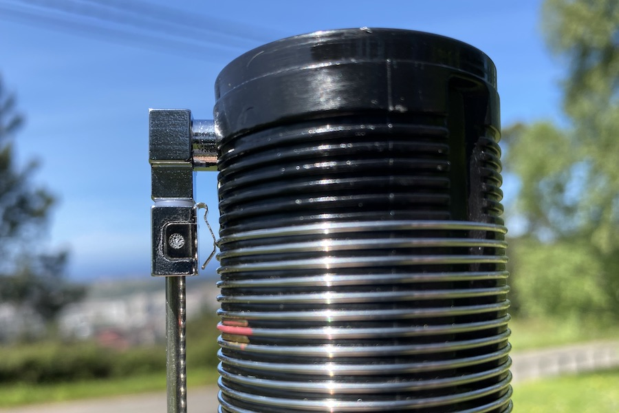

*Tuning position obtained for 10m. The preselector slider should be placed at the 6th turn counting to the top from red and gold mark in the coil. In this case, the turn to be used it’s the top one.*

## NanoVNA-H readings (SWR & Smith Chart)

- TCX0 = 26.000 000 MHz
- NanoVNA firmware / hardware details:
  - Version: 1.2.14 [p:101, IF:12k, ADC:192k, LCD:320×240]
  - Build time: Aug 31, 2022 – 13:23:46
  - Architecture: ARMv6 – Core Variant: Cortex-M0
  - Platform: STM32F072xB

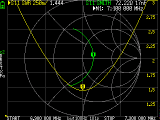

Smith Chart for 40m

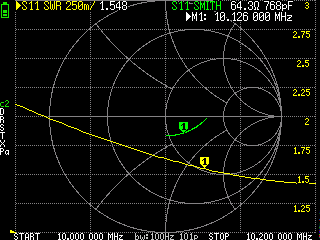

Smith Chart for 30m

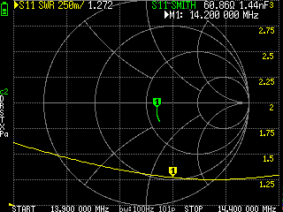

Smith Chart for 20m

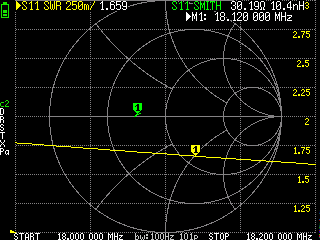

Smith Chart for 17m

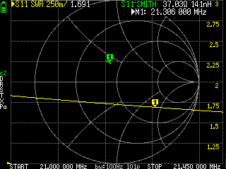

Smith Chart for 15m

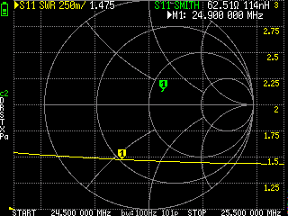

Smith Chart for 12m

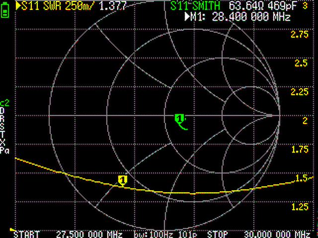

Smith Chart for 10m with coil

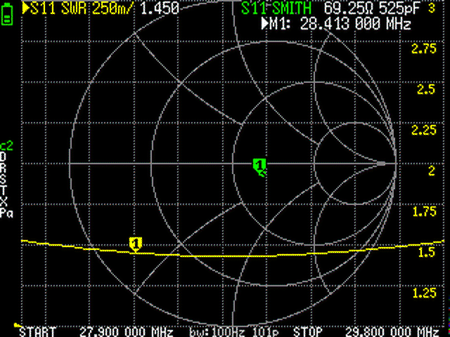

Smith Chart for 10m without coil
