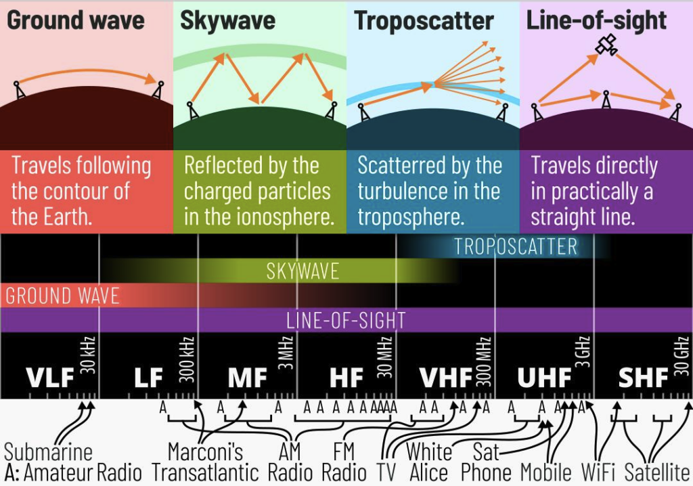

# Understanding key radio propagation concepts

[LIST OF ARTICLES](/notebook/articles/)

- **Published:** 2026-02-15
- **Last update:** 2026-02-15

Radio propagation is the behavior of radio waves as they travel from one point to another. As a form of electromagnetic radiation, radio waves are affected by reflection, refraction, diffraction, absorption, polarization, and scattering.

## Quick resume of the following complete table

- **Low HF (160m–80m):** Controlled mainly by D-layer absorption and nighttime F-layer reflection.
- **Mid HF (40m–20m):** Dominated by F2 propagation and grey line effects.
- **High HF (15m–10m):** Strongly solar-cycle dependent; Sporadic E plays a major role.
- **VHF/UHF (6m–70cm):** Mostly line-of-sight, but enhanced by Es, ducting, aurora, meteor scatter, and TEP.

## Why This Matters

- When you hear a signal from 2000 km away on 6 meters in June, it’s probably **Sporadic E**.
- When 20 meters stays open all night during solar peak, that’s **strong F2 propagation**.
- When 2 meters suddenly carries signals 1500 km across the sea, that’s likely **tropospheric ducting**.
- Recognizing these patterns urns random luck into informed operating strategy — and that’s where radio becomes truly fascinating.

## Radio propagation explained

| Concept | What It Is | Typical Distance | Most Common Bands | When It Happens | What It Feels Like |
| --- | --- | --- | --- | --- | --- |
| **D-Layer Absorption** | The lowest ionospheric layer (50–90 km) that absorbs HF signals, especially lower frequencies. | Limits range rather than extending it | 160m, 80m | Daytime | Low bands seem “dead” during the day |
| **E-Layer Propagation** | Reflection/refraction from the E layer (~90–120 km). | 800–1500 km | 40m, 20m, sometimes VHF | Daytime | Strong regional skip |
| **Sporadic E (Es)** | Intense, temporary ionized patches in the E layer that reflect higher frequencies than usual. | 600–2500 km | 10m, 6m, 2m (rare) | Late spring & summer; sometimes mid-winter | Bands suddenly explode with strong short skip signals |
| **F2 Propagation** | Reflection from the highest ionospheric layer (~250–400 km), enabling long-distance HF communication. | 3000–15000+ km | 20m, 17m, 15m, 10m | Daytime; strongest at solar maximum | Reliable global DX |
| **Grey Line Propagation** | Signal enhancement along the sunrise/sunset line where D-layer absorption drops but F-layer remains active. | Intercontinental | 30m, 40m, 20m | Around local sunrise and sunset | Signals peak dramatically for a short time |
| **Auroral Propagation** | Reflection/scatter from ionized particles during geomagnetic storms near the poles. | 1000–2500 km | 6m, 2m, 70cm | During geomagnetic storms | Signals sound distorted and raspy |
| **Transequatorial Propagation (TEP)** | Signals travel across the geomagnetic equator via ionospheric irregularities. | 4000–8000 km | 6m, 10m | Near equinoxes | Strong north-south openings |
| **Meteor Scatter** | Signals reflect off ionized trails left by meteors entering the atmosphere. | 500–2000 km | 6m, 2m | During meteor showers; also random daily | Short bursts of strong signals |
| **Tropospheric Ducting** | Signals trapped in atmospheric temperature inversion layers near the surface. | 300–2500 km | 2m, 70cm | High-pressure weather systems | Stable, long VHF/UHF contacts |
| **Troposcatter** | Weak scatter from irregularities in the lower atmosphere. | 300–600 km | 2m, 70cm | Anytime | Weak but steady long-range VHF signals |
| **Ground Wave** | Signals follow the curvature of the Earth without ionospheric reflection. | Up to ~200 km | 160m, 80m | Daytime | Reliable local/regional coverage |
